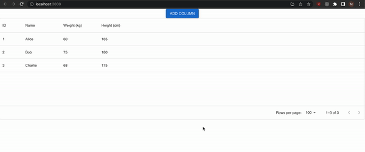

# Dynamic Table with GPT-4

This project demonstrates the power of combining React, Material-UI, and OpenAI's GPT-4 to create a dynamic table design. Users can add new columns to the table, and GPT-4 will automatically fill in the data for the new column based on the existing data in the table.



## Features

- Dynamic table design using Material-UI's DataGrid component
- Add new columns to the table on the fly
- GPT-4 integration to populate new column data based on existing data
- Real-time table population

## Getting Started

### Prerequisites

- [Node.js](https://nodejs.org/) (version 14.x or higher)
- [npm](https://www.npmjs.com/) (version 7.x or higher)
- [GPT-4 API key](https://beta.openai.com/signup/) (you will need to sign up for an API key)

### Installation

1. Clone the repository:

```bash
git clone https://github.com/MohammedAlSafwan/dynamic-table.git
```

2. Install dependencies:

```bash
cd dynamic-table
npm install
```

3. Replace the GPT-4 API key in `DynamicTable.js`:

```javascript
const apiKey = 'your-api-key'; // Replace with your GPT-4 API key
```

4. Start the development server:

```bash
npm start
```

5. Open [http://localhost:3000](http://localhost:3000) to view the app in your browser.

## Built With

- [React](https://reactjs.org/)
- [Material-UI](https://mui.com/)
- [OpenAI GPT-4](https://beta.openai.com/)

## Contributing

Pull requests are welcome. For major changes, please open an issue first to discuss what you would like to change.

## License

[MIT](./LICENSE)

## Acknowledgments

- [OpenAI](https://www.openai.com/) for providing the GPT-4 API
- [Material-UI](https://mui.com/) for the beautiful UI components
- [React](https://reactjs.org/) for making UI development enjoyable
